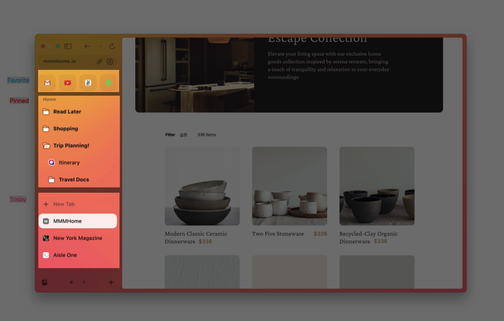

一直在网上看到Arc的消息，但作为懒癌晚期的我，懒得去找邀请码来用，而且一般测试期间的App也不太敢直接用于我的生产环境。近来 Arc 终于发布了正式版，我第一时间下载来体验使用了，在使用了大概小半天之后，我决定把我的主力浏览器从 Chrome 迁移到 Arc 使用，除了 Arc 的颜值直击我的内心之外，这几乎为互联网工作者量身打造的功能和交互方式实在是难以拒绝。

## 介绍

作为互联网时代的传统艺能，浏览器这个入口软件的风口早就泯灭在移动互联网的浪潮中，现在很多年轻人甚至都没有接触过当时凭借着操作系统绑定获得几乎所有份额的IE浏览器了。现如今Arc的出现，又捕获了大家的注意力，抛开其他不谈，这款软件的动效设计几乎充满了整款软件的所有交互部分，酷炫这个词可以在几乎所有谈论Arc的文章中看到。

基于兴趣，我去查阅了一些Arc相关的信息：

> Arc 是由 Josh Miller 和 Hursh Agrawal 创立的初创公司 The Browser Company 开发的免费的网络浏览器，在封闭测试后于2022年4月19日发布。Arc 可用于 macOS 和 iOS，但用户只能在注册等待列表后受邀下载该浏览器。Windows 版本正在开发中，并预计将于2023年发布。
> —— [Arc浏览器 - 维基百科](https://zh.wikipedia.org/wiki/Arc%E6%B5%8F%E8%A7%88%E5%99%A8)

没错这个公司的名字就叫**The Browser Company**，这是诞生在美国纽约的一家浏览器公司，在最初阶段就获得了1800万美元的投资，这家公司的很多成员都是之前在知名企业中担任过重要职务的，也包括Chrome 的联合创始人 Darin Fisher。Arc 是基于 Chromium 并用 Swift 语言开发的，也就是说，你在Chrome上插件、浏览历史记录、Cookie、密码、书签等几乎所有数据都可以无缝迁移到Arc使用。

## 颠覆认知的标签管理

如果你之前使用的浏览器标签和地址栏在顶部的话，你可能会花点时间来习惯一下侧边的设计，再你适应之后你将会获得更多的空间利用率。因为在当今的大屏时代，屏幕宽度已经严重过剩，在众多网页中都会定义一个最大宽度两边留白，这样就浪费了很多很多空间。网页内容大都是自上而下的，反而高度空间是最不容易被浪费的，所以Arc选择用侧栏来放置是一个让空间利用率更高的选择。

在传统浏览器中，输入一个地址将会打开一个新的标签页，经常会在标签栏堆积很多标签，时间久了之后都忘记之前打开了哪些标签了。尤其一些常用的工具网站，一般都是一直打开在浏览器中，以便需要的时候快速使用，但是当标签页多起来，找都找不到，最后难免会再打开一个页面，恶性循环。当然你也可以用收藏夹来管理这些标签页，从收藏夹找到这个页面并打开重新获取网页并渲染，这里花费的时间成本比常驻在标签栏的标签页会高很多。所以往往收藏夹里收藏的标签要么常年不会去点一次，要么就被淹没在无穷无尽的标签项里。

而Arc明确的给标签划分成三种：Today、Pinned、Favorite。虽然有种类区别，但是他们本质上都是一个标签项，点击会切换网页，但不会打开新的标签项，接下来介绍一下它们的区别。
- Today
  这个类别的标签会有一个默认的自动清理时间，默认是12小时，可以在设置中更改，会随Space变化而变化
- Pinned
  支持创建文件夹管理，会随Space变化而变化
- Favorite
  处于标签栏的最顶端，最多可以添加12个，不会随Space而变化

然后这里所有的类型，本质都是一个标签页面，直接点击就能打开页面，但是从Pinned和Favorite中点击跳转链接时，会出现一个标识，标记当前标签已经不是当时加入时的路径，也能快速回到当时加入的路径。如果从网页内打开了一个新页面或者跳出外站，就会打开一个浮动的窗口，临时让你操作使用，并不会新打开一个标签，当然如果你需要，你也可以把这个浮动窗口放大变成一个Today标签。

其实也不必刻意去控制这些标签的类别，因为Today的规则是12个小时自动清理，当你坚持使用几天之后，你就会知道哪些页面你并不想被Arc自动清理，那么把它放到Pinned里面去就可以了。当你切换工作区时，还会经常使用到另一个工作区的网页，那么把它放到Favorite里面去，就可以了。Arc很聪明的利用了这样一个机制，倒逼用户对自己的标签进行管理。

## 待续

这次仅仅讲了Arc的很小一部分，后面有时间给大家介绍Arc重新定义浏览器的部分，比如：Spaces、Boosts、Easels等等
