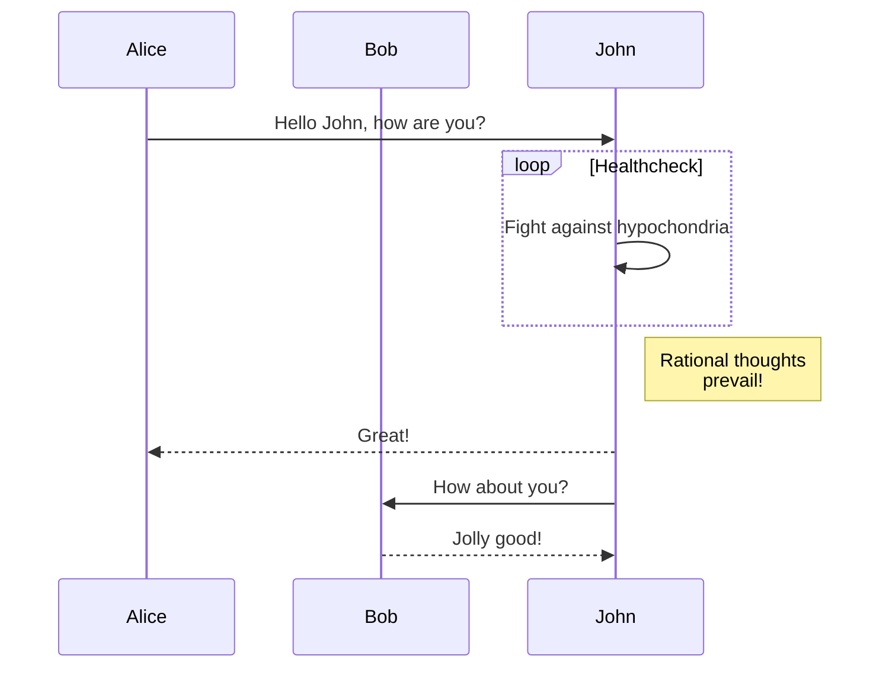
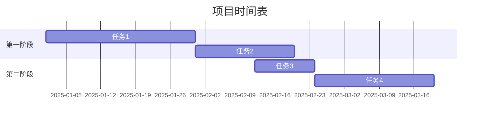

# Markdown 语法测试文档

这是一个完整的 Markdown 语法测试文档，包含所有常用的 Markdown 元素。

## 标题测试

# 一级标题 H1
## 二级标题 H2
### 三级标题 H3
#### 四级标题 H4
##### 五级标题 H5
###### 六级标题 H6

---

## 文本样式

**粗体文本** 或者 __粗体文本__

*斜体文本* 或者 _斜体文本_

***粗斜体文本*** 或者 ___粗斜体文本___

~~删除线文本~~

`行内代码`

==高亮文本==（部分渲染器支持）

上标：X<sup>2</sup>

下标：H<sub>2</sub>O

---

## 链接

[普通链接](https://rainey.space)

[带标题的链接](https://rainey.space "Rainey's Blog")

<https://rainey.space>

[引用式链接][1]

[1]: https://github.com/RaineySpace "GitHub"

---

## 图片


[](https://rainey.space)

---

## 列表

### 无序列表

- 项目 1
- 项目 2
  - 子项目 2.1
  - 子项目 2.2
    - 子子项目 2.2.1
- 项目 3

* 使用星号
+ 使用加号

### 有序列表

1. 第一项
2. 第二项
   1. 子项 2.1
   2. 子项 2.2
3. 第三项

### 任务列表

- [x] 已完成任务
- [x] 另一个已完成任务
- [ ] 未完成任务
- [ ] 待办事项

---

## 引用

> 这是一段引用文本
> 
> 可以有多行
>
> > 嵌套引用
> > 
> > > 多层嵌套

---

## 代码块

### 行内代码

这是 `console.log('Hello World')` 行内代码。

### 代码块

```javascript
// JavaScript 代码
function greet(name) {
  console.log(`Hello, ${name}!`);
}

greet('Rainey');
```

```python
# Python 代码
def hello(name):
    print(f"Hello, {name}!")

hello("Rainey")
```

```bash
# Shell 命令
npm install
git commit -m "Initial commit"
```

```json
{
  "name": "test",
  "version": "1.0.0",
  "description": "Markdown test"
}
```

```typescript
// TypeScript 代码
interface User {
  name: string;
  age: number;
}

const user: User = {
  name: "Rainey",
  age: 18
};
```

```css
/* CSS 样式 */
.container {
  display: flex;
  justify-content: center;
  align-items: center;
}
```

---

## 表格

| 列1 | 列2 | 列3 |
| --- | --- | --- |
| 单元格1 | 单元格2 | 单元格3 |
| 单元格4 | 单元格5 | 单元格6 |

### 对齐表格

| 左对齐 | 居中对齐 | 右对齐 |
| :--- | :---: | ---: |
| 内容1 | 内容2 | 内容3 |
| 内容4 | 内容5 | 内容6 |
| 较长的内容 | 中等 | 短 |

---

## 水平分割线

使用三个或更多的：

---

***

___

- - -

---

## Emoji 表情

😀 😃 😄 😁 😆 😅 🤣 😂

👋 👍 👎 🙏 💪 ✌️ 🤝

❤️ 💙 💚 💛 🧡 💜 🖤 🤍

🎉 🎊 🎈 🎁 🏆 🥇 🥈 🥉

📱 💻 ⌨️ 🖥️ 🖱️ 🖨️ 📷 📸

🚀 🌟 ✨ 💫 ⭐ 🌈 🔥 💯

---

## 脚注

这是一个包含脚注的文本[^1]。

这是另一个脚注[^note]。

[^1]: 这是第一个脚注的内容。
[^note]: 这是命名脚注的内容，可以包含**格式化**文本。

---

## 转义字符

使用反斜杠转义特殊字符：

\* 不是列表  
\# 不是标题  
\[不是链接\]  
\`不是代码\`  
\\ 反斜杠本身

---

## HTML 标签

<div style="color: red;">
  <p>可以使用 HTML 标签</p>
  <strong>粗体</strong>
  <em>斜体</em>
</div>

<details>
<summary>点击展开</summary>

这是隐藏的内容，点击上方可以展开或收起。

</details>

<br>

<mark>高亮标记</mark>

---

## 数学公式（LaTeX）

行内公式：$E = mc^2$

块级公式：

$$
\frac{n!}{k!(n-k)!} = \binom{n}{k}
$$

$$
\int_{0}^{\infty} x^2 dx
$$

$$
\sum_{i=1}^{n} i = \frac{n(n+1)}{2}
$$

---

## 定义列表

术语1
: 定义1

术语2
: 定义2a
: 定义2b

---

## 缩写

HTML 是 HyperText Markup Language 的缩写。

*[HTML]: HyperText Markup Language

---

## 键盘按键

按 <kbd>Ctrl</kbd> + <kbd>C</kbd> 复制

按 <kbd>Ctrl</kbd> + <kbd>V</kbd> 粘贴

按 <kbd>⌘</kbd> + <kbd>Q</kbd> 退出（Mac）

按 <kbd>Alt</kbd> + <kbd>Tab</kbd> 切换窗口

---

## 徽章示例


---

## 换行测试

这是第一行  
这是第二行（使用两个空格换行）

这是第三行<br>
这是第四行（使用HTML br标签）

这是第五行

这是第六行（空一行）

---

## 引用链接

我经常访问 [Google][google]、[GitHub][github] 和 [Stack Overflow][so]。

[google]: https://www.google.com "谷歌"
[github]: https://github.com "GitHub"
[so]: https://stackoverflow.com "Stack Overflow"

---

## 自动链接

访问 https://rainey.space 了解更多。

发送邮件到 example@example.com

---

## 混合示例

### 📝 代办清单

- [x] **第一步**：了解基本语法
- [x] *第二步*：练习使用
- [ ] ~~第三步~~：深入学习
- [ ] 第四步：创建自己的文档

### 🔗 相关资源

1. [Markdown 官方文档](https://daringfireball.net/projects/markdown/)
2. [GitHub Flavored Markdown](https://github.github.com/gfm/)
3. [Markdown Guide](https://www.markdownguide.org/)

### 💡 小贴士

> **注意**：不同的 Markdown 渲染器可能支持不同的语法扩展。
> 
> 建议在使用前先测试你的渲染器支持哪些特性。

---

## 复杂表格示例

| 功能 | 描述 | 状态 | 优先级 |
|:-----|:-----|:----:|------:|
| 标题 | 支持6级标题 | ✅ | 高 |
| 列表 | 有序、无序、任务列表 | ✅ | 高 |
| 代码 | 行内和代码块 | ✅ | 高 |
| 表格 | 支持对齐 | ✅ | 中 |
| 数学 | LaTeX 公式 | ⚠️ | 低 |

---

## 嵌套列表与代码

1. 第一步：安装依赖
   ```bash
   npm install
   ```

2. 第二步：运行项目
   ```bash
   npm run dev
   ```

3. 第三步：访问
   - 本地开发：`http://localhost:3000`
   - 生产环境：`https://rainey.space`

---

## 引用中的代码

> 在终端中运行以下命令：
> 
> ```bash
> git clone https://github.com/RaineySpace/RaineySpace.git
> cd RaineySpace
> npm install
> ```
> 
> 然后就可以开始开发了！

---

## 列表中的表格

### 支持的编程语言

- **前端语言**

  | 语言 | 用途 |
  |------|------|
  | JavaScript | 网页交互 |
  | TypeScript | 类型安全 |
  | CSS | 样式设计 |

- **后端语言**

  | 语言 | 用途 |
  |------|------|
  | Node.js | 服务器端 |
  | Python | 数据处理 |

---

## 特殊符号

版权符号：&copy; 2025

注册商标：&reg;

商标符号：&trade;

小于：&lt;

大于：&gt;

与符号：&amp;

引号：&quot;

---

## Mermaid 图表（如果支持）




---

## 流程图（如果支持）

```flow
st=>start: 开始
op=>operation: 我的操作
cond=>condition: 是或否?
e=>end: 结束

st->op->cond
cond(yes)->e
cond(no)->op
```

---

## 甘特图（如果支持）



---

## 注释

[//]: # (这是一个注释，不会被渲染)

[//]: # "这也是一个注释"

<!--
这是 HTML 风格的注释
也不会被渲染
-->

---

## 结束

感谢阅读！如有问题，欢迎在 [GitHub](https://github.com/RaineySpace) 上联系我。

**最后更新**：2025年11月26日

---

## 附录：常用 Markdown 速查

| 语法 | 效果 |
|------|------|
| `**粗体**` | **粗体** |
| `*斜体*` | *斜体* |
| `~~删除线~~` | ~~删除线~~ |
| `` `代码` `` | `代码` |
| `[链接](url)` | [链接](https://rainey.space) |
| `` | 图片 |
| `- 列表` | 无序列表 |
| `1. 列表` | 有序列表 |
| `> 引用` | 引用块 |
| `---` | 水平线 |
