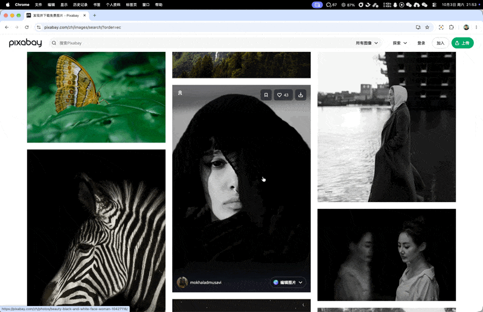
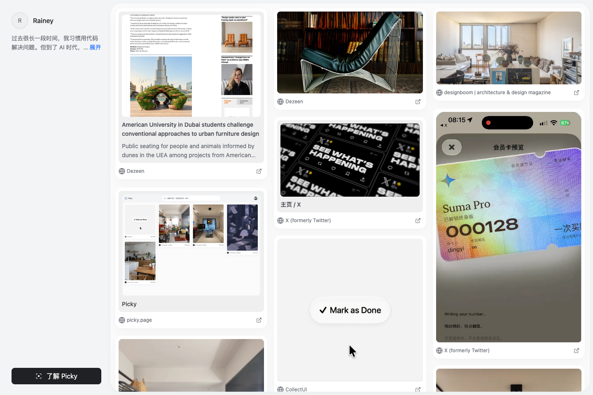

我经常会在网上看到一些很想留下来的东西。

可能是一段很有意思的文字，一种很有艺术感的设计，或者一组让我特别喜欢的摄影作品。吸引我的有时是内容，有时是表达方式，有时只是某个很难说清楚、但看见就觉得喜欢的细节。

最初的想法很简单：把它们收集起来。

后来仔细想想，这些东西其实有一个共同点——它们都是我从互联网这片茫茫大海里，自己挑选出来的。

同一个网页，不同的人可能注意到完全不同的部分。有人喜欢一句话，有人喜欢一张图片，也有人会被某种配色、排版或者摄影风格吸引。那些让人愿意停下来、留下来的东西，多少都反映了这个人的兴趣和审美。

如果把这些选择放在一起，它们是不是也能成为一个展示自己的窗口？

[Picky](https://picky.page "project:picky") 就是沿着这个想法，慢慢变成现在这个样子的。

它的定位是一个对外分享自身品味的软件：从互联网里挑选自己喜欢的东西，再把它们组织成一份可供他人阅读的页面。

## 选择本身，也是一种表达

最早考虑 Picky 时，我想过一个很直接的形式：浏览网页，遇到喜欢的内容就 Pick 一下，这条链接便进入自己的公开页面。别人可以来阅读，也可以通过 RSS 订阅这些选择。

这个想法吸引我的地方，在于表达可以自然地发生在日常浏览中。

写一篇文章，需要把想法组织成语言。分享自己的选择，则可以从一个更轻的动作开始。一篇文章、一张照片、一种设计，被放进我的页面里，本身就已经透露了一点东西：我为什么会注意到它，我最近对什么感兴趣，我喜欢怎样的表达。

当然，一次收藏能够表达的信息很有限。但当这些选择持续积累，放在一起看时，它们之间会慢慢出现联系。

我想做的，就是给这些选择一个可以被看见、被阅读的地方。

这也决定了 Picky 需要同时照顾两件事：挑选时足够顺手，展示时也值得打开。前者让选择能够持续发生，后者让积累下来的内容真正成为一个对外的窗口。

## 给喜欢的东西拍张照

继续往下想，只保存链接又有些不够。

外部链接指向的内容可能会变。下一次打开时，页面可能已经修改，当时喜欢的那一块内容也可能不在原来的位置了。

而且，我想留下来的东西，经常只是网页中的一部分。

可能是一段文字、一张图片、一张设计得很好的卡片，或者几个元素组合在一起的样子。保存整个网页地址，并不能直接保留我当时注意到的那个细节。

于是我想到，可以给它拍张照。

我挺喜欢这种感觉：在浏览的过程中，遇到一个想留下来的画面，就把当时看到的样子保存下来。以后回看，能够直接找到那一块让我产生收藏念头的内容。

如果选中的是文字，那自然还应该能够复制。把文字提取出来，之后想引用、搜索或者继续使用时，也会方便很多。图片能够直接取得时，就保存图片；需要保留某个区域的视觉关系时，就用截图记录。

这样，一个 Pick 逐渐有了几种彼此补充的信息：当时看到的样子、能够继续使用的内容，以及回到原处的来源链接。

收藏的对象，也从一个网址，逐渐变成了“我在这个网页里，具体想留下的东西”。

## 先让我选到真正想要的那一块

真正开始做以后，Pick 过程本身花了很多时间。

“从网页里选一块内容”听起来很简单，落到实际操作里，却有很多需要琢磨的地方。

人看网页时，很容易把一张图片、一段文字或者一张卡片理解成一个完整对象。但网页内部的结构，未必刚好对应这些视觉边界。自动识别可能选中一大块区域，也可能停留在一个很小的元素上。

我参考了浏览器开发者工具选择元素的方式：鼠标移动到哪里，就识别当前位置的网页元素。这提供了一个很好的起点。

但使用过程中，我又发现，自动识别经常选不到真正想要的子元素。

于是，选择过程逐渐变成了可以一步步靠近目标的过程。

先确定一个大致范围，然后在这个范围里继续选择更小的元素；如果最初是自己拖出来的矩形，也可以继续选择其中的具体内容。范围不合适时，还可以拖动边缘调整。

我当时对这件事的描述是：

> 一步一步缩小范围，直到用户的目标。

用户可以先从一个大概正确的范围开始，再慢慢选到自己想留下的那一部分。这比要求自动识别第一次就完全猜中人的意图，更符合实际使用时的情况。

同时，我也在控制操作路径的数量。

讨论中出现过一些额外的交互方案，比如点击选区外重新选择，或者从外面再次拖拽。我后来觉得，一次选择就先把这次选择完成。选错了，用 Esc 或工具栏退出，已经能够处理很多情况。

每增加一种操作方式，用户就需要多理解一点规则。我希望保留的那些操作，能够直接帮助人选准内容。

## 四个角、一颗蓝点，和一次快门

除了选得准，我也很在意选择过程看起来是什么样子。

Picky 的标志里有四个角和一颗蓝点。这些元素很适合进入挑选过程：四个角标出范围，蓝点跟随鼠标，周围的遮罩则让当前关注的内容显现出来。

在一个本来就很复杂的网页里，用户需要一眼看清自己正在选择什么。

因此，我反复调整过四角的形状、弧度和粗细，也调整过遮罩的深浅。鼠标移动到不同内容上时，选框怎样变化；扩大或缩小范围时，视觉上怎样跟随；继续细选时，外层范围和里面的候选区域怎样区分——这些细节都影响着操作是否直观。

随着交互不断调整，“选什么”和“确认收藏”也逐渐被分开。

先选中，再细调，最后确认。双击可以把选框扩展到当前网页视口，选区内的短按仍然可以继续细选，长按则用来确认这次收藏。

后来，我又花了不少时间琢磨长按时的反馈。

最终确定的过程是：在选区内按住，边缘立即变成黑色实线，鼠标消失，中心出现 Logo 里的蓝点。四个角向中心聚拢，逐渐组成一个完整的 Picky 标志。

*长按确认一次 Pick 的实际操作录屏。*

随后开始采集内容。真实图片准备好以后，选区轻轻闪一下，像按了一次快门。刚刚挑选的内容形成一张卡片，在选区中心出现，再滑入右侧的预览区。

这也和最初“给它拍张照”的想法接上了。

我希望从框住内容，到确认，再到内容变成卡片，整个过程是连续的。用户能够看见自己选中的东西，怎样被留下来。

这里也需要照顾实际状态。确认动作完成、内容进入保存队列、最终保存成功，各自都有对应的反馈。卡片展示的是这一次真正采集到的内容，动画也要跟着真实过程发生。

一次 Pick 交给后台保存后，选择模式就退出，用户可以继续浏览网页。

这个明确的收尾，也是后来专门调整的。一次挑选完成，就回到原来的浏览过程里；下一次遇到喜欢的东西，再开始下一次 Pick。

## 把这些选择放进同一个主页

在打磨采集过程的同时，我也一直在调整：这些内容最后应该怎样被组织、被别人看到。

中途采用过先私有保存，再整理和发布的方案。随着产品继续推进，独立的发布流程被取消，最后确定的规则是默认公开，同时保留私有选项。

这个决定和 Picky 的定位是一致的。

我想让日常的选择能够持续进入对外展示的页面。新建合集默认公开，没有整理进合集的内容也默认公开。希望留给自己看的内容，可以放进私有合集，也可以关闭未归类内容的公开展示。

每条 Pick 最多属于一个合集，让内容的归属和公开范围更容易理解。

个人主页也经历了一轮简化。

早先的结构有个人主页，也有单独的合集页面。后来我觉得，可以直接在个人主页平铺所有可公开的 Picks，把合集变成筛选项。这样，别人打开页面，就能先看到这个人挑选的内容，再按自己的兴趣切换合集。

整个页面因此围绕两个部分展开：这个人是谁，以及这个人选择了什么。

*我的 [Picky 公开主页](https://picky.page/rainey)。日常挑选的网页、图片和设计，汇成一个可以直接阅读的页面。*

我陆续去掉了一些多余的标题和按钮，也反复调整过个人资料、合集导航和内容列表之间的关系。文字要能读，图片要保留自己的比例，内容本身需要有足够的空间。

这里的呈现很重要。

一段文字吸引人的地方可能就在措辞里，一张照片的感觉可能来自完整的构图，一块设计的特点可能藏在它的留白和比例中。页面需要让这些东西好好地被看见，才能让选择背后的品味显现出来。

最终，采集、整理和展示连在了一起：我在日常浏览中挑选内容，这些内容逐渐积累到自己的页面里，别人则可以沿着这些选择，认识我的一个侧面。

## AI 可以以后再来理解这些选择

我也想过，这些积累下来的内容，将来可能让 AI 更了解一个人的品味。

我们喜欢什么，愿意留下什么，怎样把不同的内容放在一起，都包含着一些很个人的判断。持续积累以后，AI 或许可以从中学到东西，再帮助我们做一些事情。

这个方向让我觉得有意思，但具体怎样做，还可以继续探索。

眼下，我觉得 Picky 已经有一件很值得做好的事：让我能够从互联网里挑出自己喜欢的东西，留下它们，组织成一份别人可以阅读的页面。

从最初想收集几段文字、一些设计和喜欢的摄影风格，到后来反复琢磨一个选框怎样出现、一张卡片怎样形成、一个主页怎样展开，Picky 就是在这些具体的选择里慢慢长出来的。

以后，我还会遇到新的内容，兴趣和审美也会继续变化。

那个页面可以跟着这些选择慢慢变化，留下我在不同阶段注意到了什么、喜欢上了什么。别人打开它时，看到的就是我从互联网里一点点挑选出来的、属于自己的品味。

[Picky](https://picky.page "project:picky")
